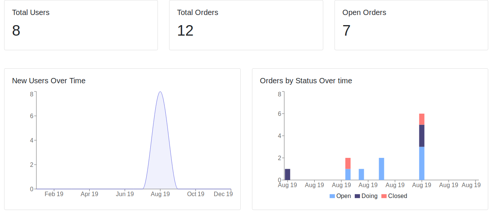

# Learn CubeJS
Repositório de aprendizagem.

View


Playground and Editor, após executar o servidor abra no browser:

`http://localhost:4000/`

Obs: Caso queira criar tudo pelo playground execute o servidor como administrador, para que o mesmo possa criar arquivos na pasta.

## Assets
### Database
Na pasta `database-scripts` estão os scripts para criação e inserção de dados para o exemplo;

### Backend
O servidor está na pasta `dashboard-backend`;

O servidor é todo configurado pelo CubeJS.

Configurando o arquivo `.env`

```ini
CUBEJS_DB_HOST=127.0.0.1
CUBEJS_DB_NAME=trycubejs
CUBEJS_DB_USER=root
CUBEJS_DB_PASS=123
CUBEJS_DB_TYPE=mysql
CUBEJS_API_SECRET=<AUTO GERADO>
```

Para executar, na pasta, execute:

`npm run dev` 


### Frontend
A aplicação está na pasta `dashboard-frontend`;

A aplicação está em React;

Configurando o arquivo `.env`

```ini
REACT_APP_CUBEJS_TOKEN=<TOKEN>
REACT_APP_API_URL=http://localhost:4000/cubejs-api/v1
```

Para executar, na pasta, execute:

`yarn start`


## Ref
1. https://cube.dev/
1. https://dev.to/cubejs/cube-js-the-open-source-dashboard-framework-ultimate-guide-53be


Goiânia, 21-08-2019
By: Ramyres Aquino